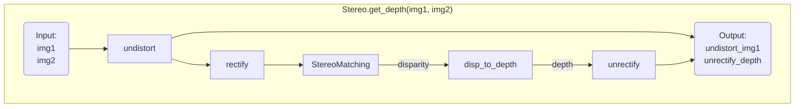

# `calibrating`: A Python Library for Camera Calibration
Calibrate camera's intrinsic/extristric, and build stereo depth camera with OpenCV python.

[](https://yl-data.github.io/2108.calibrating-vis/stereo/index.html)
<!--  -->


## ▮ Features
- High-level API that simplifies calibration steps
- Object-oriented Pythonic code style
- Rich visualization to verify the calibration effect. e.g. [stereo-rectify-vis](https://yl-data.github.io/2108.calibrating-vis/stereo/index.html), [reproject-depth-vis](https://yl-data.github.io/2108.calibrating-vis/project-depth/index.html)
- Very easy to install and run the example with [example images](https://github.com/yl-data/calibrating_example_data)
- Mature [stereo module](calibrating/stereo.py) for correctly converting disparity to depth map that aligned with the left camera
- Provide camera internal and external parameters standard, which can be exported as `.yaml`
- Decoupling the feature extraction and calibration process, support both checkboard and markers(`cv2.aruco`)
- Support [occluded markers](example/test_occlude_marker.py) like [ArUco](https://docs.opencv.org/4.x/d5/dae/tutorial_aruco_detection.html) and [ChArUco](https://docs.opencv.org/4.6.0/df/d4a/tutorial_charuco_detection.html)
- Draw various calibration board images
- Automatically ignore non-compliant images or markers

## ▮ Install
```bash
pip3 install calibrating
```
## ▮ Run Example
[Example images](https://github.com/yl-data/calibrating_example_data) are captured by paired_stereo_and_depth_cams:   
[](https://github.com/yl-data/calibrating_example_data/raw/master/paired_stereo_and_depth_cams.jpg?raw=true)

```bash
pip3 install calibrating
# Prepare example data(100MB): checkboard images of paired stereo and depth cameras
git clone https://github.com/yl-data/calibrating_example_data

# Prepare example code
git clone https://github.com/DIYer22/calibrating

# Run checkboard example 
python3 calibrating/example/checkboard_example.py
```
Finally, your browser will open [stereo-rectify-vis](https://yl-data.github.io/2108.calibrating-vis/stereo/index.html), [reproject-depth-vis](https://yl-data.github.io/2108.calibrating-vis/project-depth/index.html)


Detailed example code with comments: [example/checkboard_example.py](example/checkboard_example.py)   
Or Chinese Version: [example/checkboard_example_cn.py (中文注释)](example/checkboard_example_cn.py)

## ▮ Stereo

**Run [stereo example](calibrating/stereo.py):**
```bash
python3 calibrating/calibrating/stereo.py
```
After a while, your browser will open:
- [stereo-rectify-vis](https://yl-data.github.io/2108.calibrating-vis/stereo/index.html)
- [StereoSGBM-depth-vis](https://yl-data.github.io/2108.calibrating-vis/stereo_sgbm_vis/): Which shows `undistort_img1`, `unrectify_depth`. The example disparity is computed by `cv2.StereoSGBM`.

**Another stereo depth example:**
```
python3 calibrating/example/test_depth_accuracy.py
```
your browser will pop up a visual web page like this  


**[Mermaid](https://mermaid.live/) flowchart of `calbrating.Stereo.get_depth(img1, img2)`**



