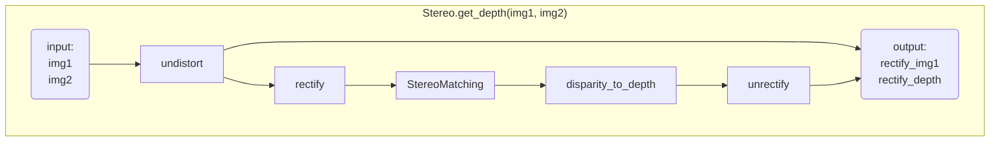

# `calibrating`: A Python Library for Camera Calibration
Calibrate the internal and external parameters of cameras, rectify stereo cameras by OpenCV python.

[](https://yl-data.github.io/2108.calibrating-vis/stereo/index.html)
<!--  -->

## ▮ Features
- [High-level API](example/checkboard_example.py) that simplifies calibration steps
- Rich visualization to verify the calibration effect. e.g. [stereo-rectify-vis](https://yl-data.github.io/2108.calibrating-vis/stereo/index.html), [reproject-depth-vis](https://yl-data.github.io/2108.calibrating-vis/project-depth/index.html)
- Very easy to install and run example
- Mature [stereo module](calibrating/stereo.py) for correctly calculate the depth
- Decoupling the feature extraction and calibration process, support both checkboard and markers(`cv2.aruco`)
- Provide camera internal and external parameters standard, which can be exported as `.yaml`
- Support for [occluded marker](example/test_occlude_marker.py)
- Automatically ignore non-compliant images
## ▮ Install
```bash
pip3 install calibrating
```
## ▮ Run Example
Example images are captured by paired_stereo_and_depth_cams:   
[](https://github.com/yl-data/calibrating_example_data/raw/master/paired_stereo_and_depth_cams.jpg?raw=true)

```bash
pip3 install calibrating
# Prepare example data(100MB): checkboard images of paired stereo and depth cameras
git clone https://github.com/yl-data/calibrating_example_data

# Prepare example code
git clone https://github.com/DIYer22/calibrating

# Run checkboard example 
python3 calibrating/example/checkboard_example.py
```
Finally, your browser will open [stereo-rectify-vis](https://yl-data.github.io/2108.calibrating-vis/stereo/index.html), [reproject-depth-vis](https://yl-data.github.io/2108.calibrating-vis/project-depth/index.html)


Detailed example code with comments: [example/checkboard_example.py](example/checkboard_example.py)   
Or Chinese Version: [example/checkboard_example_cn.py (中文注释)](example/checkboard_example_cn.py)

## ▮ Stereo

Run [stereo example](calibrating/stereo.py):
```bash
python3 calibrating/calibrating/stereo.py
```
After a while, your browser will open:
- [stereo-rectify-vis](https://yl-data.github.io/2108.calibrating-vis/stereo/index.html)
- [StereoSGBM-depth-vis](https://yl-data.github.io/2108.calibrating-vis/stereo_sgbm_vis/): Which shows `undistort_img1`, `unrectify_depth`. The example disparity is computed by `cv2.StereoSGBM`.

**[Mermaid](https://mermaid.live/) flowchart of `calbrating.Stereo.get_depth(img1, img2)`**



